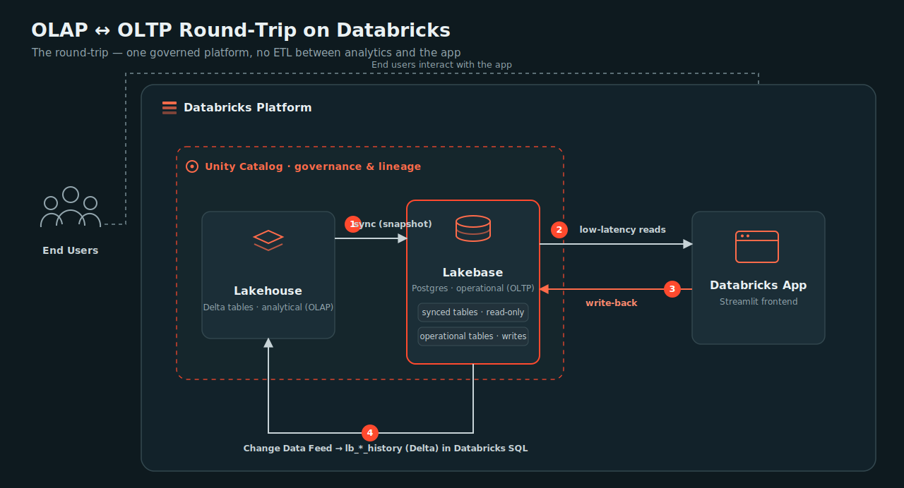

# App + Lakebase in a Day

A hands-on workshop covering the Databricks **Apps + Lakebase round-trip** — from analytical
data in Unity Catalog, to an operational Postgres database and a live app, and back to
analytics. Use it for instructor-led training or self-paced learning.

## Scenario — "Keep the line running"

*(A manufacturing example — but the pattern fits logistics, retail, fintech, anywhere. No
manufacturing background needed.)*

> Operational data usually lands in tables in Unity Catalog — great for analytics. But the
> people who need it most, working in real time, can't work off a data warehouse. **Lakebase +
> Apps** serve that data operationally, let those people act on it, and play their actions
> straight back into analytics.

A factory runs **50 machines** streaming telemetry (temperature, vibration, load) into the
lakehouse. The data team mines it for reporting and a breakdown-prediction model — but that
intelligence is trapped in dashboards. When a machine spikes at 2 a.m., the night-shift
technician needs a dead-simple app: *"which machines need attention, and let me log what I
did."* That's an operational job the lakehouse isn't built for — so you sync the data into
**Lakebase**, serve it through a **Databricks App** (a Maintenance Cockpit), let the technician
log what they did, and — via **Change Data Feed** — their work flows straight back into the
lakehouse. Full write-up: [`docs/scenario.md`](docs/scenario.md).

## Before the workshop (workspace admin, once)

Run the admin-setup cells in **[Lab 0, Step 1](labs/Lab%200%20-%20Setup.md)** — they create a
`lakebase-workshop-participants` group and grant it everything participants need (workspace +
SQL entitlements, Unity Catalog grants, warehouse `CAN_USE`). Full privilege reference:
[`docs/roles-and-permissions.md`](docs/roles-and-permissions.md); access-request template:
[`docs/access-request-template.md`](docs/access-request-template.md).

## Get started

1. In Databricks: **Workspace ▸ Create ▸ Git folder**, paste this repo's URL, **Create**.
2. Open **[`labs/Lab 0 - Setup.md`](labs/Lab%200%20-%20Setup.md)** and follow the labs in order.
   Read [`docs/concepts.md`](docs/concepts.md) first if the ideas are new (10 min).

## The labs

Each lab is a markdown guide with the code inline, "what just happened" explainers, and ✅
checks. The runnable notebooks/app live in [`bundle/src/`](bundle/src).

| Lab | Topic | Guide |
|-----|-------|-------|
| **Lab 0** | Setup — get the repo into your workspace, provision access, choose a start | [guide](labs/Lab%200%20-%20Setup.md) |
| **Lab 1** | Generate the analytical data in Unity Catalog | [guide](labs/Lab%201%20-%20Generate%20Analytical%20Data.md) |
| **Lab 2** | Sync into Lakebase, add operational tables, stream writes back via CDF | [guide](labs/Lab%202%20-%20Sync%20to%20Lakebase.md) |
| **Lab 3** | Build & deploy the Maintenance Cockpit app; implement the write-back | [guide](labs/Lab%203%20-%20Build%20and%20Deploy%20the%20App.md) |
| **Lab 4** | Close the round-trip — the app's writes, live in Databricks SQL | [guide](labs/Lab%204%20-%20Close%20the%20Round-Trip.md) |

## Repository layout

| Path | Purpose |
|------|---------|
| `labs/` | The workshop guides (Lab 0–4) — each with the runnable code **inline** |
| `bundle/` | Databricks Asset Bundle to deploy the app ([README](bundle/README.md)); `src/app/` holds the Streamlit app |
| `docs/` | `scenario.md`, `concepts.md`, `architecture.svg`, `roles-and-permissions.md`, `access-request-template.md`, `dashboard.md` |

## What you'll build

`UC Delta ─①SNAPSHOT sync→ Lakebase synced tables ─②reads→ Streamlit app ─③write→ operational tables ─④Change Data Feed→ lb_*_history in Databricks SQL`

One governed platform serves both the analyst and the person on the floor — and their actions
make the analytics smarter. No second database to secure, no ETL between the two worlds.
